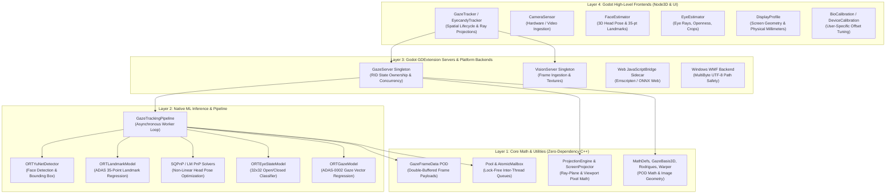
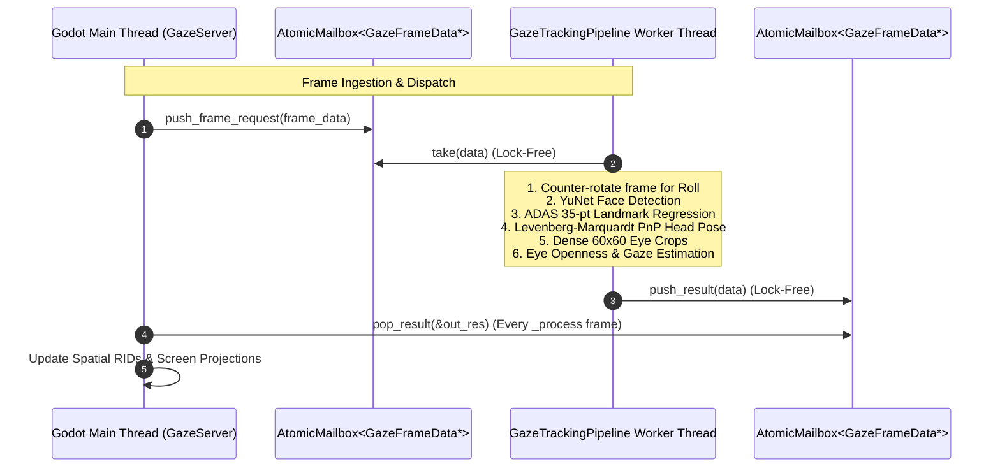
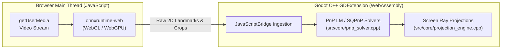

# System Architecture & Technical Specification

**Project:** `godot-gaze`  
**Integration:** Godot 4 GDExtension Plugin  
**Reference Application:** `eyecandy`  

---

## 1. Architectural Topology

`godot-gaze` is engineered as a strictly layered 3D gaze-tracking and facial analysis engine. It decouples high-level engine nodes from numerical algorithms, hardware ingestion, and ONNX Runtime neural inference backends.

---

## 2. Layer Isolation & Purity Rules

1. **Layer 1 (Core - `src/core/`):**
   - Must remain **100% zero-dependency pure C++17/20 standard library**.
   - No inclusion of `<godot_cpp/...>` headers, no Godot RIDs, no ONNX Runtime headers, and no platform-specific OS APIs.
   - Responsible for pure geometric math, screen projections, numerical solvers, and thread-safe data containers (`AtomicMailbox`, `Pool`).

2. **Layer 2 (Native ML - `src/native/`):**
   - Wraps ONNX Runtime (`onnxruntime_cxx_api.h`).
   - Implements multi-threaded inference pipelining (`GazeTrackingPipeline`).
   - Does not depend on Godot engine types or GDScript bindings.

3. **Layer 3 (Platforms & Servers - `src/godot/`, `src/windows/`, `src/web/`):**
   - Implements Godot's RID (Resource Identifier) server architecture (`GazeServer`, `VisionServer`).
   - Manages platform camera feeds (Windows Media Foundation, Godot CameraFeed, Web `getUserMedia`).
   - Enforces Pimpl (`GazeServerImpl`) encapsulation to insulate Godot bindings from native allocations.

4. **Layer 4 (High-Level Nodes - `src/godot/` & `eyecandy`):**
   - `Node3D` and `RefCounted` classes (`GazeTracker`, `CameraSensor`, `FaceEstimator`, `EyeEstimator`, `DisplayProfile`, `EyecandyTracker.gd`).
   - Communicates with backends solely by passing RIDs to `GazeServer` and `VisionServer`.

---

## 3. Concurrency & Threading Model

- **Lock-Free Pipeline Execution:** The background inference worker thread communicates with Godot exclusively via `AtomicMailbox<GazeFrameData*>`. The worker loop never locks `GazeServer::state_mutex`.
- **Main Thread Mutex Safety:** `GazeServer::state_mutex` exists solely to synchronize concurrent or recursive GDScript/C++ calls against internal RID registry dictionaries.

---

## 4. Hardware & Memory Model: Why CPU RAM is the Common Denominator

Our tracking pipeline is a multi-stage **hybrid pipeline**:
$$\text{Camera Frame} \xrightarrow{\text{CPU}} \text{YuNet CNN} \xrightarrow{\text{CPU Transform}} \text{ADAS LM CNN} \xrightarrow{\text{CPU PnP Solver}} \text{ADAS GazeNet CNN} \xrightarrow{\text{Screen Projection}}$$

### Why Zero-Copy GPU Roundtrips Were Rejected
- **Iterative Solvers on CPU:** Head pose estimation requires a non-linear Levenberg-Marquardt / SQPnP optimization solver over 35 $(X, Y)$ landmarks. This is an iterative CPU numerical algorithm.
- **Cross-Platform GDExtension Boundaries:** Passing GPU textures directly into neural execution providers (e.g. DirectML, Metal, WebGPU) without CPU readbacks requires compute shaders for intermediate bounding-box rotations and eye crops across macOS, Windows, Android, and WebAssembly.
- **Contiguous CPU Memory:** Pre-allocating contiguous BGR buffers (`GazeFrameData::camera_raw_bgr`, `GazeFrameData::rotated_frame_bgr`) provides zero-allocation steady-state performance at 60 FPS without GPU $\leftrightarrow$ CPU synchronization pipeline bubbles.

---

## 5. WebAssembly & JavaScript Boundary Architecture

For Godot Web exports (HTML5 / WebAssembly):

1. **Hardware & ML I/O Bridge (`gaze_sidecar.js`):**
   - Manages browser permissions and video stream capture (`navigator.mediaDevices.getUserMedia`).
   - Executes neural network graphs in browser-optimized WebGL/WebGPU kernels via `onnxruntime-web`.
   - Passes raw bounding boxes and 2D landmark coordinates to Godot via `JavaScriptBridge`.

2. **Unified Mathematical Core (C++ WebAssembly):**
   - 100% of spatial geometry, PnP head pose solving, basis rotations, and screen ray projections are compiled directly from `src/core/` into WebAssembly.
   - Eliminates JavaScript math duplication and guarantees identical behavior between Native desktop and Web builds.
   - WebAssembly execution reduces main-thread CPU time by ~2x–4x compared to pure JavaScript numerical loops.
