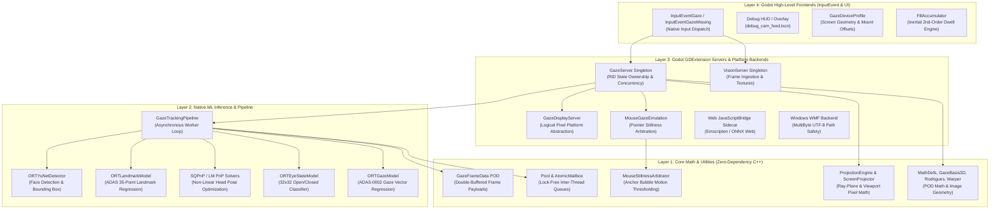
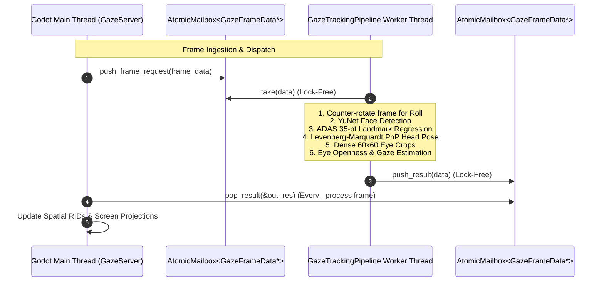
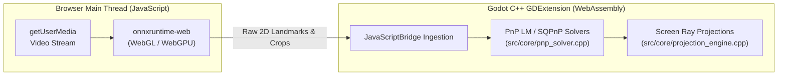
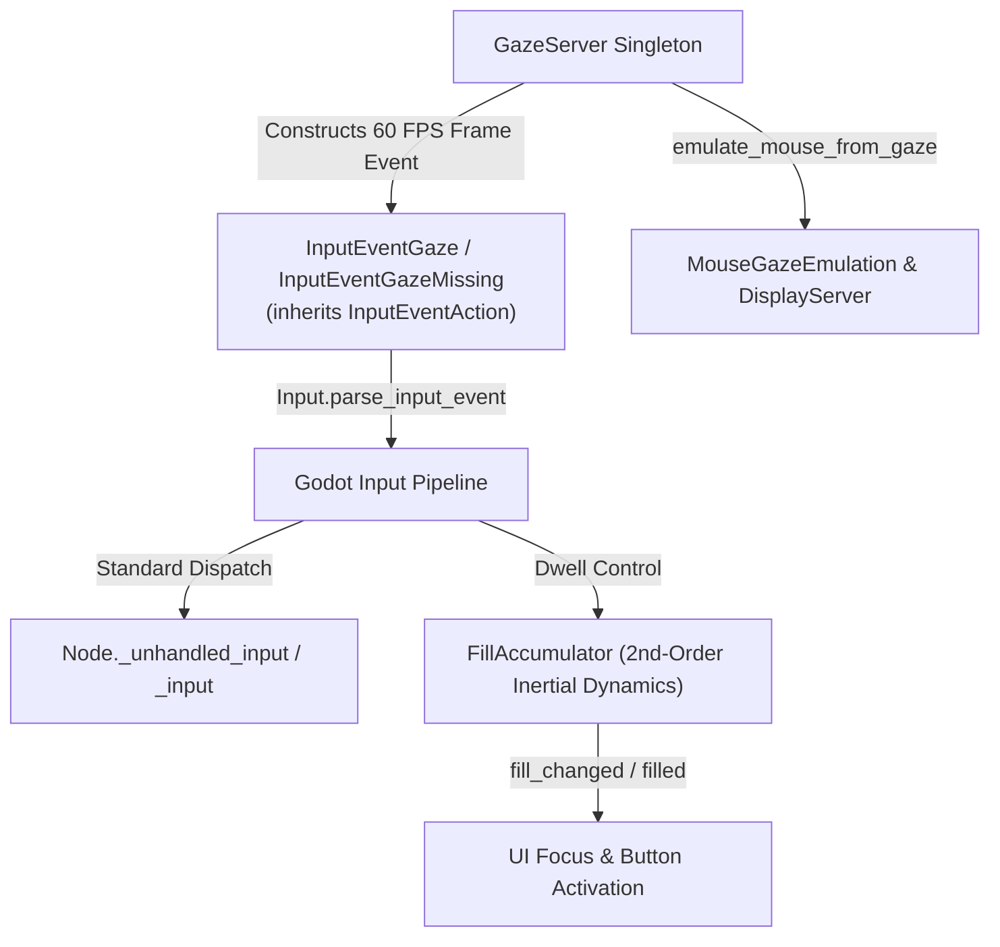

# System Architecture & Technical Specification

**Project:** `godot-gaze`  
**Integration:** Godot 4 GDExtension Plugin  

---

## 1. Architectural Topology

`godot-gaze` is engineered as a strictly layered 3D gaze-tracking and facial analysis engine. It decouples high-level engine nodes from numerical algorithms, hardware ingestion, and ONNX Runtime neural inference backends.

---

## 2. Layer Isolation & Purity Rules

1. **Layer 1 (Core - `src/core/`):**
   - Must remain **100% zero-dependency pure C++17/20 standard library**.
   - No inclusion of `<godot_cpp/...>` headers, no Godot RIDs, no ONNX Runtime headers, and no platform-specific OS APIs.
   - Responsible for pure geometric math, screen projections, numerical solvers, and thread-safe data containers (`AtomicMailbox`, `Pool`).

2. **Layer 2 (Native ML - `src/native/`):**
   - Wraps ONNX Runtime (`onnxruntime_cxx_api.h`).
   - Implements multi-threaded inference pipelining (`GazeTrackingPipeline`).
   - Does not depend on Godot engine types or GDScript bindings.
   - For detailed neural model specifications, tensor formats, and provenances, see [Vision Models & Camera Ingestion Specification](file:///Users/acunningham/src/godot-gaze/docs/vision_models.md).

3. **Layer 3 (Platforms & Servers - `src/godot/`, `src/windows/`, `src/web/`):**
   - Implements Godot's RID (Resource Identifier) server architecture (`GazeServer`, `VisionServer`).
   - Manages platform camera feeds (Windows Media Foundation, Godot CameraFeed, Web `getUserMedia`).
   - Normalizes hardware capture frames to packed BGR8 working buffers (see [Vision Models & Camera Ingestion Specification](file:///Users/acunningham/src/godot-gaze/docs/vision_models.md#1-camera-ingestion-architecture--color-formats)).
   - Enforces Pimpl (`GazeServerImpl`) encapsulation to insulate Godot bindings from native allocations.

4. **Layer 4 (High-Level Nodes & Events - `src/godot/` & downstream scenes):**
   - `GazeTracker` declarative node and `GazeTracker.track_node()` lifecycle manager.
   - `InputEventGazeBase`, `InputEventGaze`, `InputEventGazeMissing`, and resources (`GazeDeviceProfile`, `GazePipelineConfig`).
   - Communicates with backends solely by managing `GazeTracker` lifecycle, querying `GazeServer`, or receiving input events.

---

## 3. Concurrency & Threading Model

- **Lock-Free Pipeline Execution:** The background inference worker thread communicates with Godot exclusively via `AtomicMailbox<GazeFrameData*>`. The worker loop never locks `GazeServer::state_mutex`.
- **Main Thread Mutex Safety:** `GazeServer::state_mutex` exists solely to synchronize concurrent or recursive GDScript/C++ calls against internal RID registry dictionaries.

---

## 4. Hardware & Memory Model: Why CPU RAM is the Common Denominator

Our tracking pipeline is a multi-stage **hybrid pipeline**:
$$\text{Camera Frame} \xrightarrow{\text{CPU}} \text{YuNet CNN} \xrightarrow{\text{CPU Transform}} \text{ADAS LM CNN} \xrightarrow{\text{CPU PnP Solver}} \text{ADAS GazeNet CNN} \xrightarrow{\text{Screen Projection}}$$

### Why Zero-Copy GPU Roundtrips Were Rejected
- **Iterative Solvers on CPU:** Head pose estimation requires a non-linear Levenberg-Marquardt / SQPnP optimization solver over 35 $(X, Y)$ landmarks. This is an iterative CPU numerical algorithm.
- **Cross-Platform GDExtension Boundaries:** Passing GPU textures directly into neural execution providers (e.g. DirectML, Metal, WebGPU) without CPU readbacks requires compute shaders for intermediate bounding-box rotations and eye crops across macOS, Windows, Android, and WebAssembly.
- **Contiguous CPU Memory:** Pre-allocating contiguous BGR buffers (`GazeFrameData::camera_raw_bgr`, `GazeFrameData::rotated_frame_bgr`) provides zero-allocation steady-state performance at 60 FPS without GPU $\leftrightarrow$ CPU synchronization pipeline bubbles.

---

## 5. WebAssembly & JavaScript Boundary Architecture

For Godot Web exports (HTML5 / WebAssembly):

1. **Hardware & ML I/O Bridge (`gaze_sidecar.js`):**
   - Manages browser permissions and video stream capture (`navigator.mediaDevices.getUserMedia`).
   - Executes neural network graphs in browser-optimized WebGL/WebGPU kernels via `onnxruntime-web`.
   - Passes raw bounding boxes and 2D landmark coordinates to Godot via `JavaScriptBridge`.

2. **Unified Mathematical Core (C++ WebAssembly):**
   - 100% of spatial geometry, PnP head pose solving, basis rotations, and screen ray projections are compiled directly from `src/core/` into WebAssembly.
   - Eliminates JavaScript math duplication and guarantees identical behavior between Native desktop and Web builds.
   - WebAssembly execution reduces main-thread CPU time by ~2x–4x compared to pure JavaScript numerical loops.

---

## 6. Input Subsystem & Event Architecture

`godot-gaze` models eye-gaze as first-class engine input events routed through Godot's standard input tree (`Input.parse_input_event()`), while providing seamless OS mouse emulation and 2nd-order inertial dwell mechanics.

### 6.1. First-Class Events: `InputEventGazeBase`, `InputEventGaze`, `InputEventGazeMissing`
- **Inheritance**: Subclasses `InputEventAction` (concrete in Godot's `ClassDB`), enabling registration and routing through `Input::get_singleton()->parse_input_event()`.
- **`InputEventGazeBase`**:
  - `window_id: int`, `frame_id: int`, `timestamp_usec: int`.
  - Continuous eye openness: `left_eye_openness: float`, `right_eye_openness: float` ($0.0$ closed to $1.0$ open).
  - Blink queries: `is_blink(threshold = 0.5)`, `is_left_blink()`, `is_right_blink()`.
  - `is_face_tracked() -> bool`: Virtual method, returning false on base/missing and true on `InputEventGaze`.
- **`InputEventGaze`**:
  - Dispatched when face detection and gaze estimation succeed.
  - **Localized 2D Coordinates**:
    - `get_eye_gaze(node = null) -> Vector2`: Combined eye-gaze screen/viewport coordinate in logical pixels (`lpix`). When `node` is passed, returns coordinates mapped directly into the local 2D coordinate space of `node`.
    - `get_nose_gaze(node = null) -> Vector2`: Nose bridge / head forward projection coordinate in logical pixels (`lpix`).
  - **3D Spatial Transforms**:
    - `get_eye_transform() -> Transform3D`: Full 3D gaze ray origin and orientation in camera millimeters.
    - `get_nose_transform() -> Transform3D`: Full 3D head pose origin and orientation in camera millimeters.
  - **Kinematics & Clamping**:
    - `relative: Vector2`, `velocity: Vector2` ($\Delta\text{pos}/\Delta t$ in px/sec).
    - `clamping_mode`: `CLAMP_MODE_NONE` (0), `CLAMP_MODE_CLAMP` (1), `CLAMP_MODE_DISCARD` (2).
- **`InputEventGazeMissing`**:
  - Dispatched when face or eye tracking drops.
  - Carries `reason: MissingReason` (`REASON_NO_FACE_DETECTED`, `REASON_OCCLUSION_BLINK`, `REASON_OUT_OF_BOUNDS`, `REASON_LOW_CONFIDENCE`).

### 6.2. Pointer Arbitration & Mouse Emulation (`MouseGazeEmulation`)
`godot-gaze` integrates a native C++ mouse stillness arbitrator ([`MouseStillnessArbitrator`](file:///Users/acunningham/src/godot-gaze/src/core/mouse_stillness_arbitrator.hpp)) and pointer emulator ([`MouseGazeEmulation`](file:///Users/acunningham/src/godot-gaze/src/godot/mouse_gaze_emulation.hpp)):
- **Stillness Arbitration**: When physical mouse motion exceeds the anchor bubble threshold (`mouse_stillness_threshold_px`, default $3.0\text{ px}$), the physical mouse claims instant authority. When the mouse remains motionless within the anchor bubble for `mouse_stillness_duration_sec` (default $1.5\text{ s}$), gaze smoothly resumes control via an eased blend transition.
- **Bi-Directional Emulation**:
  - `gaze/pointing/emulate_mouse_from_gaze = true`: Synthesizes OS mouse motion and click events into Godot's `DisplayServer`, driving standard engine UI controls directly.
  - `gaze/pointing/emulate_gaze_from_mouse = true`: In developer environments without webcams, synthesizes `InputEventGaze` from mouse movements to exercise downstream gaze pipelines.

### 6.3. Inertial Dwell Mechanics (`FillAccumulator`)
For hands-free eye-gaze selection without physical clicks, `FillAccumulator` provides a 2nd-order dynamical dwell state machine:
- **Kinematic Formulation**:
  $$\frac{dv}{dt} = \begin{cases} a_{\text{fill}} & \text{if gazing on target (charging, } \text{error} \le 0) \\ -a_{\text{drain}} \cdot \text{penalty} & \text{if off target (releasing, } \text{error} > 0) \end{cases}$$
  $$\text{penalty} = 1.0 + \frac{\text{error}}{\text{error\_doubling\_distance}}$$
  $$\frac{d(\text{fill})}{dt} = v, \quad v \in [-v_{\text{drain}} \cdot \text{penalty}, +v_{\text{fill}}], \quad \text{fill} \in [0.0, 1.0]$$
- **Micro-Saccade & Blink Momentum Tolerance**: Because velocity ramps with finite acceleration ($a \approx 32\text{ units/s}^2$), a brief $100\text{–}150\text{ ms}$ physiological blink or micro-saccade only begins decelerating positive velocity. The accumulator coasts forward or holds, preventing jarring resets or progress dumps during natural gaze flutter.
- **Fuzzy Boundary Matching (`error_doubling_distance`)**: For UI buttons ([`DwellButton`](file:///Users/acunningham/src/eyecandy/project/gaze/ui/DwellButton.gd)), near-miss boundary tremors ($10\text{ px}$) incur negligible drain penalty ($\approx 1.1\times$), providing forgiving foveal tolerance. In contrast, an intentional saccade across the display ($300\text{ px}$) scales the drain penalty to $4\times$, purging momentum and draining in $<150\text{ ms}$ so the next target can be acquired immediately.
- **Signal Separation Invariant**: Enforces a strict domain separation bound ($\Delta \ge 0.50$ between empty and full states) preventing accidental activations.
- **Signals**: `fill_started`, `fill_changed(fill: float)`, `filled`, `emptied`.

---

## 7. GazeDisplayServer & Platform Windowing Abstraction

To ensure mathematically consistent projection geometry and seamless mouse-gaze emulation, `godot-gaze` introduces `GazeDisplayServer` as an authoritative platform windowing and pointer abstraction.

### 7.1. Architectural Rationale: Why Not Rely on Godot's `DisplayServer`?
Godot's built-in `DisplayServer` contains platform-dependent inconsistencies regarding HiDPI scaling, coordinate spaces, and window decorations:
- On macOS Retina, Godot's `DisplayServer.mouse_get_position()` scales cursor coordinates to physical device pixels (e.g. $2\times$), whereas window client dimensions and Cocoa view coordinates natively operate in logical points.
- On Windows, `DisplayServer.window_get_position()` includes non-client window borders and drop shadows, offsetting the client drawing area.
- On Web (HTML5), Godot reports internal WebGL canvas buffer dimensions rather than CSS layout geometry.

Downstream tracking math (e.g., `ProjectionEngine`, `GazeServer`, and `MouseGazeEmulation`) requires a single, self-consistent coordinate model. Rather than scattering ad-hoc platform workarounds throughout consumers, `GazeDisplayServer` guarantees a strict contract backed by dedicated per-platform native implementations (`src/macos`, `src/windows`, `src/ios`, `src/android`, `src/web`, `src/native`).

### 7.2. The Unified Coordinate Contract: Logical Display Pixels (`lpix`)
All spatial and pointer queries on `GazeDisplayServer` operate strictly in **Logical Display Coordinates** (`lpix` / points / CSS pixels):
* **`get_screen_size_pixels()`**: Display dimensions $(W_{\text{disp}}, H_{\text{disp}})_{\text{lpix}}$ in logical units.
* **`get_window_rect_pixels()`**: Application window client rect $[x, y, w, h]_{\text{lpix}}$ relative to display top-left origin.
* **`mouse_get_position()`**: OS cursor screen position $(x, y)_{\text{lpix}}$ relative to display top-left origin.
* **`mouse_get_button_state()`**: Bitmask of pressed mouse buttons directly from the OS.
* **`get_screen_scale()`**: Backing-store HiDPI scale factor $S = \text{ppix} / \text{lpix}$ ($2.0$ on Retina, $\text{DPI}/96$ on Windows, `devicePixelRatio` on Web).
* **`get_pixel_pitch_mm()`**: Physical millimeters per logical pixel: $(W_{\text{mm}} / W_{\text{lpix}}, H_{\text{mm}} / H_{\text{lpix}})$.

### 7.3. Platform Variance Matrix (`GazeDisplayServer` vs. Godot `DisplayServer`)

| Platform | Query / Metric | Godot `DisplayServer` | `GazeDisplayServer` (Authoritative) | Variance & Design Rationale |
| :--- | :--- | :--- | :--- | :--- |
| **macOS** | `mouse_get_position()` | **Physical Pixels** (multiplies Cocoa `[NSEvent mouseLocation]` by `screen_scale`, e.g. $\times 2.0$) | **Logical Pixels (Points)** (Native `CGEventGetLocation` / `[NSEvent mouseLocation]` top-left) | **Major Divergence**: Godot scales mouse coordinates to physical device pixels, creating a $2\times$ offset against Cocoa window rects. `GazeDisplayServer` stays in points. |
| **macOS** | `get_window_rect_pixels()` | **Physical Pixels** when HiDPI is enabled (`window_get_position()`, `window_get_size()`) | **Logical Pixels (Points)** (`contentRectForFrameRect` client area in points) | **Major Divergence**: Godot's position/size scale inconsistently and can include window frame decoration. `GazeDisplayServer` returns the exact client rect in points. |
| **macOS** | `get_screen_size_pixels()` | **Physical Pixels** (`screen_get_size()`) | **Logical Pixels (Points)** (`CGDisplayModeGetWidth/Height`) | Matches the coordinate space of window rect and mouse position. |
| **Windows** | `mouse_get_position()` | Physical or unscaled coords depending on DPI awareness mode | **Logical Pixels** (`GetCursorPos` normalized by $\text{DPI}/96.0$) | **DPI Divergence**: Guarantees scale-independent logical coordinates across multi-monitor setups with mixed DPI. |
| **Windows** | `get_window_rect_pixels()` | Frame rect (includes non-client decorations / drop shadows) | **Logical Client Rect** (`GetClientRect` + `ClientToScreen` normalized by $\text{DPI}/96.0$) | **Divergence**: Godot includes window drop-shadows and borders; `GazeDisplayServer` measures the true client viewport. |
| **Web** | `mouse_get_position()` | Canvas-relative or client coordinates depending on canvas CSS | **CSS Pixels** relative to screen origin | Consistent with browser `window.screen` geometry. |
| **Web** | `get_window_rect_pixels()` | Internal WebGL canvas buffer pixels (`width`, `height`) | **CSS Pixels** (`canvas.getBoundingClientRect()`) | **Major Divergence**: Godot returns the WebGL backing store size; `GazeDisplayServer` returns layout position and size in CSS pixels. |
| **iOS** | `get_screen_size_pixels()` / `window_rect` | Physical pixels or mixed points | **UIKit Points** (`UIScreen.bounds`, `UIWindow.bounds`) | Preserves 1:1 scale invariance with touch coordinates. |
| **Android** | `get_screen_size_pixels()` / `window_rect` | Device physical pixels | **DIPs** (Density-Independent Pixels) | Consistent logical units across display densities. |

