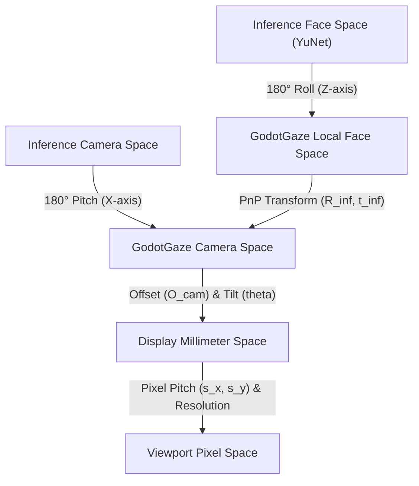

# Gaze Tracking Mathematical & Physical Model

This document outlines the coordinate systems, physical screen mapping projection math, biological calibration models, and optimization formulation utilized in `godot-gaze`.

---

## 1. Coordinate Systems

To model the physical and inference tracking states, the engine utilizes five distinct 3D and 2D coordinate spaces.

### 1.1. Inference Camera Space
* **Origin ($C_{\text{inf}}$)**: Optical center of the camera lens.
* **$X_{\text{inf}}$-axis**: Horizontal, pointing right from the camera's perspective (subject's left).
* **$Y_{\text{inf}}$-axis**: Vertical, pointing down.
* **$Z_{\text{inf}}$-axis**: Optical axis, pointing forward into the camera's view cone (towards the subject).

### 1.2. Inference Face Space
This is the space of the 3D facial model used by YuNet's `solvePnP` solver (eyes, nose, mouth corners):
* **Origin**: Midpoint of the eyes at depth 0.
* **$X_{\text{face\_inf}}$-axis**: Horizontal, pointing to the face's own left (image right).
* **$Y_{\text{face\_inf}}$-axis**: Vertical, pointing down.
* **$Z_{\text{face\_inf}}$-axis**: Perpendicular to the face plane, pointing to the back of the head (the nose points along $-Z_{\text{face\_inf}}$).

### 1.3. GodotGaze Camera Space (Standard Camera Space)
This space is aligned with standard right-handed graphics conventions:
* **Origin ($C_{\text{cam}}$)**: Optical center of the camera lens.
* **$X_{\text{cam}}$-axis**: Horizontal, pointing right from the camera's perspective.
* **$Y_{\text{cam}}$-axis**: Vertical, pointing up.
* **$Z_{\text{cam}}$-axis**: Perpendicular to the display, pointing out the back of the camera **away** from the camera's view cone. Thus, the user is located at negative Z ($z_{\text{cam}} < 0$).
* **Mapping from Inference Camera Space**:
  To correct the vertical direction (Y points down in Inference, up in GodotGaze) and the forward/backward direction (Z points forward/into-view-cone in Inference, backward/away-from-view-cone in GodotGaze), we apply a **$180^\circ$ pitch rotation around the X-axis**:
  $$M = R_X(180^\circ) = \begin{pmatrix} 1 & 0 & 0 \\ 0 & -1 & 0 \\ 0 & 0 & -1 \end{pmatrix}$$
  This maps the coordinates as:
  $$X_{\text{cam}} = X_{\text{inf}}$$
  $$Y_{\text{cam}} = -Y_{\text{inf}}$$
  $$Z_{\text{cam}} = -Z_{\text{inf}}$$

### 1.4. GodotGaze Face Space (Face Space)
This is the standard local coordinate space of the user's head:
* **Origin**: Midpoint of the eyes.
* **$X_{\text{local}}$-axis**: Horizontal, pointing to the user's right ear.
* **$Y_{\text{local}}$-axis**: Vertical, pointing up the face.
* **$Z_{\text{local}}$-axis**: Perpendicular to the face plane, pointing to the back of the head. Thus, the nose points along $-Z_{\text{local}}$ (forward).
* **Mapping to Inference Face Space**:
  To align with the standard Inference face coordinate system (where Y points down the face and X points to the face's own left), we apply a **$180^\circ$ roll rotation around the Z-axis**:
  $$R_Z(180^\circ) = \begin{pmatrix} -1 & 0 & 0 \\ 0 & -1 & 0 \\ 0 & 0 & 1 \end{pmatrix}$$
  This flips both the local X and Y axes while keeping the Z-axis (pointing to the back of the head) unchanged:
  $$X_{\text{face\_inf}} = -X_{\text{local}}$$
  $$Y_{\text{face\_inf}} = -Y_{\text{local}}$$
  $$Z_{\text{face\_inf}} = Z_{\text{local}}$$

### 1.5. Transformation between Spaces
Any local point $P_{\text{local}}$ in GodotGaze Face Space is mapped to GodotGaze Camera Space $P_{\text{cam}}$ via:
$$P_{\text{cam}} = R_{\text{cam}} \cdot P_{\text{local}} + t_{\text{cam}}$$
where:
$$R_{\text{cam}} = M \cdot R_{\text{inf}} \cdot M \cdot R_Y(180^\circ)$$
$$t_{\text{cam}} = M \cdot t_{\text{inf}}$$
Here, $R_{\text{inf}}$ and $t_{\text{inf}}$ are the rotation and translation returned by the inference pipeline's `solvePnP` solver.

This can be expressed as a chain of 3D transforms:
$$T_{\text{ggaze\_face\_to\_ggaze\_cam}} = T_{\text{inf\_cam\_to\_ggaze\_cam}} \cdot T_{\text{inf\_face\_to\_inf\_cam}} \cdot T_{\text{ggaze\_face\_to\_inf\_face}}$$

### 1.6. Physical Display Space (Monitor Local Space)
This centered millimeter coordinate system defines symmetric screen planes:
* **Origin ($S$)**: Center of the physical display/monitor screen.
* **X-axis**: Horizontal, pointing right (in mm).
* **Y-axis**: Vertical, pointing down (in mm).
* **Z-axis**: Perpendicular to the screen plane, pointing toward the user (in mm).
* The flat display plane is defined by the equation $z_{\text{screen}} = 0$.

---

## 2. Parameterization & Scale Invariance

Instead of treating total monitor size as an independent parameter, we parameterize the display using the display **Pixel Size** (pixel pitch) in millimeters:
$$\mathbf{s}_{\text{pixel\_size}} = (s_x, s_y) \quad \text{[mm/pixel]}$$

For a display with hardware resolution $(W_{\text{pixels}}, H_{\text{pixels}})$, the physical dimensions of the monitor in millimeters are dynamically derived:
$$W_{\text{mm}} = W_{\text{pixels}} \cdot s_x$$
$$H_{\text{mm}} = H_{\text{pixels}} \cdot s_y$$

This formulation is **scale-invariant**: if the window size, window position, or screen resolution change (e.g., entering fullscreen, resizing, or switching displays), the physical pixel pitch $s_x, s_y$ remains constant. This allows the system to scale physical screen coordinate transformations dynamically without introducing projection errors.

---

## 3. Physical Geometry & Ray-Plane Projection

Let the camera's physical position in Physical Display Space be configured as:
* **Camera Offset ($O_{\text{cam}}$)**: Vector $(x_{\text{off}}, y_{\text{off}}, z_{\text{off}})$ in mm.
* **Camera Tilt ($\theta$)**: Downward tilt angle in degrees about the camera's local X-axis.

The rotation matrix $R$ rotating vectors from Camera Space to Physical Display Space (for tilt angle $\theta$ in radians) is:
$$R = R_x(\theta) = \begin{pmatrix} 1 & 0 & 0 \\ 0 & \cos\theta & -\sin\theta \\ 0 & \sin\theta & \cos\theta \end{pmatrix}$$

For any point $P_{\text{cam}}$ in Camera Space, its position in Physical Display Space is:
$$P_{\text{screen}} = R \cdot P_{\text{cam}} + O_{\text{cam}}$$

Substituting components:
$$x_s = x_{\text{cam}} + x_{\text{off}}$$
$$y_s = y_{\text{cam}} \cos\theta - z_{\text{cam}} \sin\theta + y_{\text{off}}$$
$$z_s = y_{\text{cam}} \sin\theta + z_{\text{cam}} \cos\theta + z_{\text{off}}$$

### 3.1. 3D Ray-Plane Intersection
A gaze ray starting at origin $P_{0\_\text{cam}} = (x_0, y_0, z_0)$ with normalized direction vector $V_{\text{cam}} = (v_x, v_y, v_z)$ in Camera Space is parameterized by $t$:
$$\mathbf{p}_{\text{cam}}(t) = P_{0\_\text{cam}} + t \cdot V_{\text{cam}}$$

To find where it intersects the screen plane, we project the ray into Physical Display Space and solve for $z_s(t) = 0$:
$$z_s(t) = (y_0 + t v_y) \sin\theta + (z_0 + t v_z) \cos\theta + z_{\text{off}} = 0$$

Solving for $t$:
$$t = - \frac{y_0 \sin\theta + z_0 \cos\theta + z_{\text{off}}}{v_y \sin\theta + v_z \cos\theta}$$

If $t < 0$, the gaze ray points away from the screen (no intersection). Otherwise, we compute the camera-space intersection point:
$$P_{\text{int\_cam}} = P_{0\_\text{cam}} + t \cdot V_{\text{cam}}$$

And transform it to the display physical coordinates $(x_s, y_s)$ in mm relative to the screen center:
$$x_s = P_{\text{int\_cam}}.x + x_{\text{off}}$$
$$y_s = -(P_{\text{int\_cam}}.y \cos\theta + P_{\text{int\_cam}}.z \sin\theta + y_{\text{off}})$$

### 3.2. Monitor-to-Viewport Pixel Mapping
We map $(x_s, y_s)$ in mm relative to the screen center to monitor-absolute pixels $(x_{\text{px}}, y_{\text{px}})$, where the top-left of the monitor is $(0, 0)$:
$$x_{\text{px}} = \frac{W_{\text{pixels}}}{2} + \frac{x_s}{s_x}$$
$$y_{\text{px}} = \frac{H_{\text{pixels}}}{2} + \frac{y_s}{s_y}$$

In a windowed Godot game, the final viewport/window-local coordinate is computed by subtracting the window offset:
$$x_{\text{viewport}} = x_{\text{px}} - \text{window\_pos.x}$$
$$y_{\text{viewport}} = y_{\text{px}} - \text{window\_pos.y}$$

---

## 4. Biological & Error Calibration Correction

Individual eye shape, eyeball depth, and camera mount errors cause systematic estimation deviations (typically $2^\circ - 5^\circ$). We correct this using two models:

### 4.1. 3D Spherical Angular Calibration (Angle Kappa)
User-specific biological offsets (such as the angle kappa between the eye's visual and optical axes) are corrected by applying angular pitch ($\alpha$) and yaw ($\beta$) biases and scale factors to the raw gaze vector $V = (v_x, v_y, v_z)$ before intersection:
1. Extract spherical angles:
   $$\phi_{\text{yaw}} = \operatorname{atan2}(v_x, v_z)$$
   $$\psi_{\text{pitch}} = \operatorname{asin}(v_y)$$
2. Apply calibration scale and biases:
   $$\phi_{\text{calib}} = \phi_{\text{yaw}} \cdot \text{scale\_yaw} + \text{bias\_yaw}$$
   $$\psi_{\text{calib}} = \psi_{\text{pitch}} \cdot \text{scale\_pitch} + \text{bias\_pitch}$$
3. Re-project to the calibrated unit vector:
   $$V_{\text{calib}} = \begin{pmatrix} -\sin\phi_{\text{calib}} \cos\psi_{\text{calib}} \\ \sin\psi_{\text{calib}} \\ -\cos\phi_{\text{calib}} \cos\psi_{\text{calib}} \end{pmatrix}$$

During calibration trigger (staring at a target screen pixel $P_{\text{target}}$):
1. Transform $P_{\text{target}}$ back to Camera Space ($P_{\text{cam\_target}}$) by reversing the rotation and translation:
   $$P_{\text{cam\_target}, x} = -x_{\text{s\_target}} + x_{\text{off}}$$
   $$P_{\text{cam\_target}, y} = A \cos\theta - z_{\text{off}} \sin\theta$$
   $$P_{\text{cam\_target}, z} = A \sin\theta + z_{\text{off}} \cos\theta$$
   where $A = -y_{\text{s\_target}} - y_{\text{off}}$.
2. The required gaze vector is:
   $$V_{\text{req}} = (P_{\text{cam\_target}} - P_{0\_\text{cam}}).\text{normalized}()$$
3. Compute the angular differences to store as $\text{bias\_pitch}$ and $\text{bias\_yaw}$:
   $$\text{bias\_yaw} = \phi_{\text{req}} - \phi_{\text{yaw}}$$
   $$\text{bias\_pitch} = \psi_{\text{req}} - \psi_{\text{pitch}}$$

### 4.2. 2D Pixel-Space Calibration
A simple translational delta applied after the pixel mapping:
$$x_{\text{px\_final}} = x_{\text{px\_projected}} + \text{bias\_pixel\_x}$$
$$y_{\text{px\_final}} = y_{\text{px\_projected}} + \text{bias\_pixel\_y}$$

---

## 5. Calibration Optimizer (Inverse Solver)

During calibration, the user looks at $N = 5$ screen targets. The system collects samples containing:
* $\mathbf{o}_i$: measured eye origin in camera space.
* $\mathbf{v}_i$: measured raw eye direction in camera space.
* $\mathbf{T}_i$: physical target pixel coordinate on the screen.

We optimize the parameter vector $\mathbf{x} = (s_x, s_y, O_y, O_z, \theta_{\text{tilt}}, \alpha, \beta)$ to minimize the sum of squared screen-space projection errors.

### 5.1. Bayesian Regularization (Soft Priors)
To prevent parameter correlation and overfitting from a sparse 5-point dataset, we add quadratic penalties to constrain the parameters to physically realistic values:
$$\text{Loss}(\mathbf{x}) = \sum_{i=1}^{N} \|\text{ProjectedPixel}(\mathbf{o}_i, \mathbf{v}_i; \mathbf{x}) - \mathbf{T}_i\|^2 + \sum_{j} \lambda_j (x_j - x_{j,\text{initial}})^2$$

Where:
* $\lambda_{\text{aspect}}$ enforces that the physical pixel size keeps a standard square aspect ratio ($s_x \approx s_y$).
* $\lambda_{\text{size}}$ keeps the pixel size near the platform-estimated DPI/DPR default.
* $\lambda_{\text{camera}}$ keeps camera offsets and tilt near their physical mounting defaults.
* $\lambda_{\text{bias}}$ penalizes large angular biases.

### 5.2. Nelder-Mead Optimization
The solver uses the derivative-free Nelder-Mead (downhill simplex) algorithm, which maintains an $M+1$ dimensional simplex (where $M=7$ parameters) and updates it via reflection, expansion, contraction, and shrinkage until convergence.

---

## 6. Real-Time Depth Triangulation (Z Engine)

Using a pinhole camera model, the distance $Z$ from the camera sensor is calculated from:
* **Interpupillary Distance (IPD)**: $63.0$ mm (constant average adult).
* **Focal Length in Pixels ($f_{\text{px}}$)**: Screen width or height scale multiplier.
* **Pixel Distance ($d_{\text{px}}$)**: Detected distance between eye centers in the 2D frame.

$$Z_{\text{mm}} = \frac{\text{IPD}_{\text{mm}} \cdot f_{\text{px}}}{d_{\text{px}}}$$
$$Z_{\text{cm}} = \frac{Z_{\text{mm}}}{10.0}$$

---

## 7. Model Sign Conventions (OpenVINO ADAS-0002)

The OpenModelZoo gaze estimation network (`gaze-estimation-adas-0002`) operates with distinct input/output coordinate space and sign conventions:

### 7.1. Input Feature Preprocessing
* **Eye Crop Inputs**: The model defines its inputs from the camera/viewer's perspective.
  * `"left_eye_image"` receives the crop of the eye appearing on the **left side of the image frame** (which is the subject's anatomical **right eye**).
  * `"right_eye_image"` receives the crop of the eye appearing on the **right side of the image frame** (the subject's anatomical **left eye**).
  * *Effect*: The eye crops are swapped relative to anatomical labeling when passed to the model.
* **Head Pose Sign Alignment**: The model expects input head pose angles in degrees with positive-left (yaw), positive-down (pitch), and positive-clockwise (roll) orientations:
  * **Yaw**: Negated (`-crops.head_pose_rotation.y`), mapping negative SolvePnP yaw to positive model yaw.
  * **Pitch**: Direct (`crops.head_pose_rotation.x`).
  * **Roll**: Negated (`-crops.head_pose_rotation.z`), aligning the roll coordinate signs.

### 7.2. Output Vector Mapping
The 3D direction vector output by the model (`raw_gaze_dir`) is mapped to GodotGaze Camera Space:
* **X Component**: Direct (`raw_gaze_dir.x`), as $+X$ points right (camera's left / user's right) in both spaces.
* **Y Component**: Direct (`raw_gaze_dir.y`), as $+Y$ points UP in both spaces.
* **Z Component**: Negated (`-raw_gaze_dir.z`), reversing the optical direction so the unit vector points forward towards the screen plane ($Z_{\text{cam}} = 0$, $v_z > 0$) rather than backward into the camera ($v_z < 0$).
* *Note*: The model outputs its gaze vector in its own left-handed space (+X right, +Y up, +Z forward towards the user). To transform this left-handed vector to the right-handed GodotGaze Camera Space (+X right, +Y up, +Z backward), we preserve X and Y and negate Z. This reflection transforms the coordinate systems correctly.
