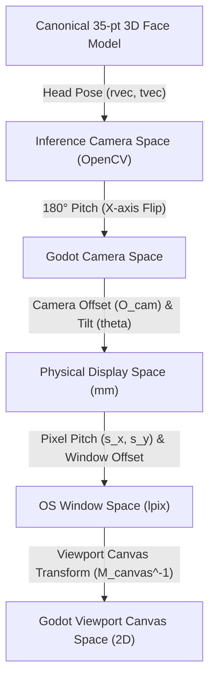

# Gaze Tracking Mathematical & Physical Model

This document outlines the coordinate systems, physical screen mapping projection math, biological calibration models, and optimization formulation utilized in `godot-gaze`.

---

## 1. Coordinate Systems & Facial Geometry

To model the physical and inference tracking states, the engine utilizes five distinct 3D and 2D coordinate spaces.

```mermaid
graph TD
    INF_FACE["Canonical 35-pt 3D Face Model"] -- "Head Pose (rvec, tvec)" --> INF_CAM["Inference Camera Space (OpenCV)"]
    INF_CAM -- "180° Pitch (X-axis Flip)" --> GG_CAM["Godot Camera Space"]
    GG_CAM -- "Camera Offset (O_cam) & Tilt (theta)" --> DISP["Physical Display Space (mm)"]
    DISP -- "Pixel Pitch (s_x, s_y) & Window Offset" --> WIN["OS Window Space (lpix)"]
    WIN -- "Viewport Canvas Transform (M_canvas^-1)" --> CANV["Godot Viewport Canvas Space (2D)"]
```

### 1.1. Inference Camera Space (OpenCV Standard)
* **Origin ($C_{\text{inf}}$)**: Optical center of the camera lens.
* **$X_{\text{inf}}$-axis**: Horizontal, pointing right from the camera's perspective (subject's left).
* **$Y_{\text{inf}}$-axis**: Vertical, pointing down.
* **$Z_{\text{inf}}$-axis**: Optical axis, pointing forward into the camera's view cone (towards the subject).

### 1.2. Canonical 35-Point Anthropometric 3D Face Model
Rather than a coarse 5-point bounding polygon, `godot-gaze` uses a 35-point anthropometric 3D face model defined directly in the camera rest frame (+X right, +Y down, +Z forward):
* **Points 0–3**: Inner and outer eye canthi for left and right eyes.
* **Points 4–15**: Eyebrow contour points.
* **Points 16–22**: Nose bridge, crest, and subnasale.
* **Points 23–34**: Upper/lower vermilion lip borders and mouth oral commissures.

### 1.3. Godot Camera Space (Standard Graphics Camera Space)
Aligned with standard right-handed graphics conventions:
* **Origin ($C_{\text{cam}}$)**: Optical center of the camera lens.
* **$X_{\text{cam}}$-axis**: Horizontal, pointing right from the camera's perspective.
* **$Y_{\text{cam}}$-axis**: Vertical, pointing up.
* **$Z_{\text{cam}}$-axis**: Perpendicular to the display, pointing **backward** out of the camera (away from the user). Thus, the user is located at negative Z ($z_{\text{cam}} < 0$).
* **Mapping from Inference Camera Space**:
  $$X_{\text{cam}} = X_{\text{inf}}$$
  $$Y_{\text{cam}} = -Y_{\text{inf}}$$
  $$Z_{\text{cam}} = -Z_{\text{inf}}$$

### 1.4. Head Pose PnP Solvers (SQPnP & Levenberg-Marquardt)
Given 35 detected 2D landmarks $\{p_i = (u_i, v_i)\}$ and corresponding 3D canonical model points $\{P_i = (X_i, Y_i, Z_i)\}$, head pose optimization computes $(r_{\text{vec}}, t_{\text{vec}})$:
1. **SQPnP (Sequential Quadratic Programming PnP):** Computes globally optimal non-iterative polynomial pose estimates.
2. **Levenberg-Marquardt Iterative Solver:** Refines pose parameters by minimizing re-projection residuals:
   $$\min_{r, t} \sum_{i=1}^{35} \left\| p_i - \pi(K, R(r) P_i + t) \right\|^2$$
   where $K$ is the camera intrinsic matrix and $\pi(\cdot)$ is the perspective projection.

### 1.5. Continuous Head Roll Un-Rotation Feedback Loop
When head roll $\phi_{\text{roll}} \neq 0$ is detected:
1. The working image frame is counter-rotated by $-\phi_{\text{roll}}$ so the face is upright for the ADAS landmark regression network.
2. After landmark extraction, landmarks and PnP pose are rotated back to original camera space via:
   $$R_{\text{final}} = R_Z(-\phi_{\text{roll}}) \cdot R_{\text{upright}}$$
   $$t_{\text{final}} = R_Z(-\phi_{\text{roll}}) \cdot t_{\text{upright}}$$

### 1.6. Physical Display Space (Monitor Local Space)
This centered millimeter coordinate system defines symmetric screen planes:
* **Origin ($S$)**: Center of the physical display/monitor screen.
* **X-axis**: Horizontal, pointing right (in mm).
* **Y-axis**: Vertical, pointing down (in mm).
* **Z-axis**: Perpendicular to the screen plane, pointing toward the user (in mm).
* The flat display plane is defined by the equation $z_{\text{screen}} = 0$.

### 1.7. OS Window Space (Logical Pixels / `lpix`)
* **Origin**: Top-left corner of the application's OS window client area.
* **Units**: Logical screen pixels (`lpix` / points / CSS pixels), governed authoritatively by `GazeDisplayServer` (see [architecture.md Section 7](architecture.md#7-gazedisplayserver--platform-windowing-abstraction)).
* **Platform Invariance**: On Retina, HiDPI, and multi-monitor setups, `GazeDisplayServer` guarantees that `get_screen_size_pixels()`, `get_window_rect_pixels()`, and `mouse_get_position()` operate in identical logical units. Spatial projection math maintains 1:1 scale invariance by working exclusively in `lpix`.

### 1.8. Godot Viewport Canvas 2D Space
* **Origin**: Top-left corner of the Godot Viewport 2D drawing canvas.
* **Units**: Virtual canvas coordinates used by `Control` nodes, 2D nodes, and `_draw()` methods.
* **Transformation Pipeline**: To convert an OS Window coordinate $\mathbf{p}_{\text{win}} \in \text{lpix}$ to Canvas space $\mathbf{p}_{\text{canvas}}$:
  1. Convert window logical pixels to window physical framebuffer pixels using screen scale factor $S = \text{GazeDisplayServer.get\_screen\_scale()}$:
     $$\mathbf{p}_{\text{phys}} = \mathbf{p}_{\text{win}} \cdot S$$
  2. Invert the Viewport's affine transformation matrix $M_{\text{canvas}} = \text{Viewport.get\_final\_transform()}$:
     $$\mathbf{p}_{\text{canvas}} = M_{\text{canvas}}^{-1} \cdot \mathbf{p}_{\text{phys}}$$
* **Closed-Loop Pointer Consistency**: For mouse-gaze emulation, the synthetic camera-space gaze target $(X_s, Y_s)$ projects through `ProjectionEngine` directly to $\mathbf{p}_{\text{win}}$, guaranteeing that $\mathbf{p}_{\text{canvas}}$ matches the native Godot mouse cursor with zero mathematical divergence.

---

## 2. Parameterization & Scale Invariance

Instead of treating total monitor size as an independent parameter, we parameterize the display using the display **Pixel Size** (pixel pitch) in millimeters:
$$\mathbf{s}_{\text{pixel\_size}} = (s_x, s_y) \quad \text{[mm/pixel]}$$

For a display with hardware resolution $(W_{\text{pixels}}, H_{\text{pixels}})$, the physical dimensions of the monitor in millimeters are dynamically derived:
$$W_{\text{mm}} = W_{\text{pixels}} \cdot s_x$$
$$H_{\text{mm}} = H_{\text{pixels}} \cdot s_y$$

This formulation is **scale-invariant**: if the window size, window position, or screen resolution change (e.g., entering fullscreen, resizing, or switching displays), the physical pixel pitch $s_x, s_y$ remains constant. This allows the system to scale physical screen coordinate transformations dynamically without introducing projection errors.

---

## 3. Physical Geometry & Ray-Plane Projection

Let the camera's physical position in Physical Display Space be configured as:
* **Camera Offset ($O_{\text{cam}}$)**: Vector $(x_{\text{off}}, y_{\text{off}}, z_{\text{off}})$ in mm.
* **Camera Tilt ($\theta$)**: Downward tilt angle in degrees about the camera's local X-axis.

The rotation matrix $R$ rotating vectors from Camera Space to Physical Display Space (for tilt angle $\theta$ in radians) is:
$$R = R_x(\theta) = \begin{pmatrix} 1 & 0 & 0 \\ 0 & \cos\theta & -\sin\theta \\ 0 & \sin\theta & \cos\theta \end{pmatrix}$$

For any point $P_{\text{cam}}$ in Camera Space, its position in Physical Display Space is:
$$P_{\text{screen}} = R \cdot P_{\text{cam}} + O_{\text{cam}}$$

Substituting components:
$$x_s = x_{\text{cam}} + x_{\text{off}}$$
$$y_s = y_{\text{cam}} \cos\theta - z_{\text{cam}} \sin\theta + y_{\text{off}}$$
$$z_s = y_{\text{cam}} \sin\theta + z_{\text{cam}} \cos\theta + z_{\text{off}}$$

### 3.1. 3D Ray-Plane Intersection
A gaze ray starting at origin $P_{0\_\text{cam}} = (x_0, y_0, z_0)$ with normalized direction vector $V_{\text{cam}} = (v_x, v_y, v_z)$ in Camera Space is parameterized by $t$:
$$\mathbf{p}_{\text{cam}}(t) = P_{0\_\text{cam}} + t \cdot V_{\text{cam}}$$

To find where it intersects the screen plane, we project the ray into Physical Display Space and solve for $z_s(t) = 0$:
$$z_s(t) = (y_0 + t v_y) \sin\theta + (z_0 + t v_z) \cos\theta + z_{\text{off}} = 0$$

Solving for $t$:
$$t = - \frac{y_0 \sin\theta + z_0 \cos\theta + z_{\text{off}}}{v_y \sin\theta + v_z \cos\theta}$$

If $t < 0$, the gaze ray points away from the screen (no intersection). Otherwise, we compute the camera-space intersection point:
$$P_{\text{int\_cam}} = P_{0\_\text{cam}} + t \cdot V_{\text{cam}}$$

### 3.2. Screen-Center Virtual Projection Anchor & OS Window Space (Logical Pixels)
In physical setups, webcams are mounted on the top bezel. However, appearance-based neural gaze estimators (e.g. OpenVINO ADAS-0002) produce compressed pitch angular distributions ($\approx \pm 5^\circ - 8^\circ$) for intra-socket eye movements when the head is stationary.

If projected from the top bezel ($Y = 0$), a maximum $-5^\circ$ downward gaze at $500\text{ mm}$ user distance covers only $500 \cdot \tan(5^\circ) = 43.7\text{ mm} \approx 218\text{ px}$, which physically prevents eye gaze from ever crossing below the screen midpoint ($Y = 540\text{ px}$ on a $1080\text{p}$ monitor).

To ensure full, symmetric vertical accessibility across the screen without requiring synthetic non-linear gain multipliers, `godot-gaze` anchors the neutral optical axis to the **Screen Center** ($W_{\text{lpix}}/2, H_{\text{lpix}}/2$):
$$x_{\text{lpix}} = \frac{W_{\text{lpix}}}{2} + \frac{P_{\text{int\_cam}}.x + x_{\text{off}}}{s_x}$$
$$y_{\text{lpix}} = \frac{H_{\text{lpix}}}{2} - \frac{P_{\text{int\_cam}}.y \cos\theta + P_{\text{int\_cam}}.z \sin\theta + y_{\text{off}}}{s_y}$$

This maps a neutral straight-ahead gaze ($V_{\text{cam}} = (0, 0, 1)$) to the center of the display, and symmetrically maps the $\pm 5^\circ$ eye pitch range across the upper and lower halves of the screen ($Y \approx 250\text{ px} \dots 830\text{ px}$).

The application window-local coordinate $\mathbf{p}_{\text{window}} = (x_{\text{win}}, y_{\text{win}})$ is computed by subtracting the window top-left desktop offset:
$$x_{\text{win}} = x_{\text{lpix}} - \text{window\_pos.x}$$
$$y_{\text{win}} = y_{\text{lpix}} - \text{window\_pos.y}$$

On HiDPI / Retina displays, all desktop quantities ($W_{\text{lpix}}, H_{\text{lpix}}, \text{window\_pos}$) are processed in logical screen points (`lpix`).

### 3.3. Unified Gravity-Aware Display Orientation & Side-Bezel Geometry ($T_{\text{camera} \to \text{viewport}}$)
When devices are rotated into portrait or landscape orientations ($0^\circ, 90^\circ, 180^\circ, 270^\circ$), the physical panel dimensions ($W_{\text{phys}}, H_{\text{phys}}$) and camera mechanical mount position ($\mathbf{O}_{\text{mount}}$) remain invariant physical constants of the hardware chassis. The device's spatial orientation is modeled strictly as a software coordinate mapping $R_{\text{display}}$ between physical display space and viewport space:

1. **Physical Screen Coordinate Calculation (Centered Origin)**:
   $$x_{\text{disp\_mm}} = \frac{W_{\text{phys}}}{2} + P_{\text{int\_cam}}.x + O_{\text{mount}}.x$$
   $$y_{\text{disp\_mm}} = \frac{H_{\text{phys}}}{2} - (P_{\text{int\_cam}}.y \cos\theta + P_{\text{int\_cam}}.z \sin\theta + O_{\text{mount}}.y)$$

2. **Display Orientation Transformation ($R_{\text{display}}$)**:
   * **$0^\circ$ (ORIENTATION_0 / Standard Upright)**:
     $$x_{\text{vp\_mm}} = x_{\text{disp\_mm}}, \quad y_{\text{vp\_mm}} = y_{\text{disp\_mm}}$$
   * **$90^\circ$ (ORIENTATION_90 / Clockwise Landscape - Camera on Right Bezel)**:
     $$x_{\text{vp\_mm}} = H_{\text{phys}} - y_{\text{disp\_mm}}, \quad y_{\text{vp\_mm}} = x_{\text{disp\_mm}}$$
   * **$180^\circ$ (ORIENTATION_180 / Inverted)**:
     $$x_{\text{vp\_mm}} = W_{\text{phys}} - x_{\text{disp\_mm}}, \quad y_{\text{vp\_mm}} = H_{\text{phys}} - y_{\text{disp\_mm}}$$
   * **$270^\circ$ (ORIENTATION_270 / Counter-Clockwise Landscape - Camera on Left Bezel)**:
     $$x_{\text{vp\_mm}} = y_{\text{disp\_mm}}, \quad y_{\text{vp\_mm}} = W_{\text{phys}} - x_{\text{disp\_mm}}$$

3. **Pixel Pitch Scaling & Window Offset**:
   $$x_{\text{vp\_px}} = x_{\text{vp\_mm}} \cdot \frac{W_{\text{lpix}}}{W_{\text{vp\_mm}}} - \text{window\_pos.x}$$
   $$y_{\text{vp\_px}} = y_{\text{vp\_mm}} \cdot \frac{H_{\text{lpix}}}{H_{\text{vp\_mm}}} - \text{window\_pos.y}$$

4. **Gravity Orientation Derivation**:
   `ProjectionEngine::gravity_to_orientation(Vector3 gravity)` dynamically maps 3D accelerometer readings to `DisplayOrientation`:
   * $g_y < -0.7 \implies \text{ORIENTATION\_0}$ (Standard Upright)
   * $g_x > 0.7 \implies \text{ORIENTATION\_90}$ (Landscape Right)
   * $g_y > 0.7 \implies \text{ORIENTATION\_180}$ (Inverted)
   * $g_x < -0.7 \implies \text{ORIENTATION\_270}$ (Landscape Left)

### 3.4. OS Window Space to Godot Viewport Canvas 2D Space (Stretch Modes)
When Godot project stretch modes are configured (e.g., `window/stretch/mode = "canvas_items"` or `"viewport"` with `aspect = "expand"` / `"keep"`), the 2D Viewport Canvas maintains a virtual base coordinate space that is scaled and letterboxed relative to the physical OS window backing render buffer:
$$M_{\text{canvas}} = \text{Viewport.get\_final\_transform()}$$

Because $M_{\text{canvas}}$ transforms from 2D Canvas coordinates to **physical backing render buffer pixels**, mapping an OS Window coordinate $\mathbf{p}_{\text{window}}$ (in logical points `lpix`, such as the output from `GazeServer.project_ray_to_viewport()`) into 2D drawing canvas space $\mathbf{p}_{\text{canvas}}$ requires converting logical points to physical pixels first via display scale $s_{\text{scale}} = \text{DisplayServer.screen\_get\_scale()}$:
$$\mathbf{p}_{\text{canvas}} = M_{\text{canvas}}^{-1} \cdot (\mathbf{p}_{\text{window}} \cdot s_{\text{scale}})$$

* **Windowed Mode ($1152 \times 648$ at $2\times$ scale, render target $2304 \times 1296$)**: $M_{\text{canvas}}$ scales by $2.0$. Multiplying by $s_{\text{scale}} = 2.0$ and applying $M_{\text{canvas}}^{-1}$ yields $\mathbf{p}_{\text{canvas}} = \frac{1}{2.0} \cdot (\mathbf{p}_{\text{window}} \cdot 2.0) = \mathbf{p}_{\text{window}}$.
* **Fullscreen Mode (e.g. $1512 \times 945\text{ pt}$ at $2\times$ scale, render target $3024 \times 1890$)**: $M_{\text{canvas}}$ applies a uniform scale factor $s = \frac{3024}{1152} = 2.625$. Multiplying by $s_{\text{scale}} = 2.0$ maps window center ($756\text{ pt}$) to physical render center ($1512\text{ px}$); applying $M_{\text{canvas}}^{-1}$ yields $\frac{1512}{2.625} = 576\text{ px}$ (exact Canvas Center), keeping 2D visual projections centered and invariant across all display modes and window sizes.

---

## 4. Biological Angle Kappa & Calibration [RETIRED]

Personalized biological Angle Kappa ($\boldsymbol{\kappa}$) calibration and non-linear multi-point simplex optimization (Nelder-Mead) were previously implemented and evaluated, but have been permanently retired:
- **Noise Floor vs. Anatomical Offset**: Anatomical Angle Kappa ($\approx 0.35^\circ\text{–}1.0^\circ$) is well below the single-camera appearance-based neural network noise floor ($\sigma \approx 1.5^\circ\text{–}2.0^\circ$).
- **Model Ocular Eccentricity Compression**: Peripheral gaze distortions ($\pm 5^\circ$ near screen borders) stem from appearance model training distributions (in-vehicle driver monitoring where gazes $> 10^\circ$ accompany head turns) rather than rigid anatomical ocular misalignments. Attempting to fit a rigid head-space rotation produces hypothesis thrashing.
- **Unified Public Contract**: All public distinction between "raw" and "calibrated" gaze has been retired. Public APIs provide unified, localized gaze via `InputEventGaze.get_eye_gaze()` and `InputEventGaze.get_nose_gaze()`.

For full historical rationale and empirical findings, see [Rejected Designs & Anti-Patterns: Item 9](file:///Users/acunningham/src/godot-gaze/docs/rejected_designs.md#L41-L44).

---

## 5. Real-Time Depth Triangulation (Z Engine)

Using a pinhole camera model, the distance $Z$ from the camera sensor is calculated from:
* **Interpupillary Distance (IPD)**: $63.0$ mm (constant average adult).
* **Focal Length in Pixels ($f_{\text{px}}$)**: Screen width or height scale multiplier.
* **Pixel Distance ($d_{\text{px}}$)**: Detected distance between eye centers in the 2D frame.

$$Z_{\text{mm}} = \frac{\text{IPD}_{\text{mm}} \cdot f_{\text{px}}}{d_{\text{px}}}$$
$$Z_{\text{cm}} = \frac{Z_{\text{mm}}}{10.0}$$

---

## 6. Model Sign Conventions (OpenVINO ADAS-0002)

The OpenModelZoo gaze estimation network (`gaze-estimation-adas-0002`) operates with distinct input/output coordinate space and sign conventions:

### 6.1. Input Feature Preprocessing
* **Eye Crop Inputs**: The model defines its inputs from the camera/viewer's perspective.
  * `"left_eye_image"` receives the crop of the eye appearing on the **left side of the image frame** (which is the subject's anatomical **right eye**).
  * `"right_eye_image"` receives the crop of the eye appearing on the **right side of the image frame** (the subject's anatomical **left eye**).
  * *Effect*: The eye crops are swapped relative to anatomical labeling when passed to the model.
* **Head Pose Sign Alignment**: The model expects input head pose angles in degrees with positive-left (yaw), positive-down (pitch), and positive-clockwise (roll) orientations:
  * **Yaw**: Negated (`-crops.head_pose_rotation.y`), mapping negative SolvePnP yaw to positive model yaw.
  * **Pitch**: Direct (`crops.head_pose_rotation.x`).
  * **Roll**: Negated (`-crops.head_pose_rotation.z`), aligning the roll coordinate signs.

### 6.2. Output Vector Mapping
The 3D direction vector output by the model (`raw_gaze_dir`) is mapped to GodotGaze Camera Space:
* **X Component**: Direct (`raw_gaze_dir.x`), as $+X$ points right (camera's left / user's right) in both spaces.
* **Y Component**: Direct (`raw_gaze_dir.y`), as $+Y$ points UP in both spaces.
* **Z Component**: Negated (`-raw_gaze_dir.z`), reversing the optical direction so the unit vector points forward towards the screen plane ($Z_{\text{cam}} = 0$, $v_z > 0$) rather than backward into the camera ($v_z < 0$).
* *Note*: The model outputs its gaze vector in its own left-handed space (+X right, +Y up, +Z forward towards the user). To transform this left-handed vector to the right-handed GodotGaze Camera Space (+X right, +Y up, +Z backward), we preserve X and Y and negate Z. This reflection transforms the coordinate systems correctly.
