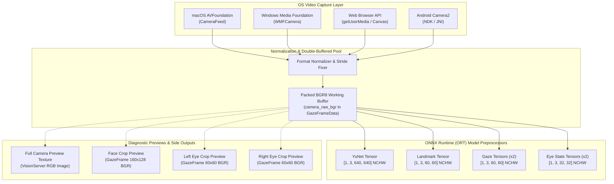

# Vision Models & Camera Ingestion Specification

This document details the hardware camera ingestion pipelines, neural network models, color spaces, tensor memory layouts, and coordinate transformations utilized in `godot-gaze`.

---

## 1. Camera Ingestion Architecture & Color Formats

Different OS and capture backends deliver video frames in varying color spaces and initialization states. The ingestion layer normalizes all incoming frames into **packed / interleaved BGR8** working buffers (`GazeFrameData::camera_raw_bgr`) before dispatching to neural inference and diagnostic preview pipelines.

### 1.1. Zero-Allocation Memory Model
All frame payloads, intermediate hint-rotation scratchpads (`rotated_frame_bgr`), dense eye crops, and neural input tensor memory (`input_tensor_data`) are **statically preallocated** within `GazeFrameData` instances managed by a lock-free `Pool<GazeFrameData>`. No heap allocations or dynamic reallocations occur during the steady-state per-frame inference loop.

### 1.2. Platform-Specific Camera Ingestion Details

| Backend / OS | Raw Capture Format | Initialization Characteristics | Normalization Action in `godot-gaze` |
| :--- | :--- | :--- | :--- |
| **macOS (AVFoundation)** | `FEED_RGBA_IMAGE` (`datatype == 1`) / `FORMAT_RGBA8` | First grabbed frame is a $4\times4$ placeholder before full resolution ($1920\times1080$) frames start arriving. | Duplicate/convert to `FORMAT_RGB8`, swap $R \leftrightarrow B$ channels to produce packed BGR8. |
| **Windows (WMF)** | `MFVideoFormat_RGB24` / `NV12` | Immediate full-resolution stream via Media Foundation source reader. | Direct BGR24 copy or NV12$\to$BGR conversion. |
| **Web (Emscripten / Canvas)** | `HTMLVideoElement` / RGBA Canvas | Browser `getUserMedia` video element streams into OffscreenCanvas. | Read RGBA pixel data, extract 3-channel BGR buffer. |
| **Android (Camera2)** | `YUV_420_888` / `NV21` | ImageReader surface with stride padding. | Convert YUV/NV21 to packed BGR8. |

---

## 2. Model Catalog & Neural Preprocessing

All neural inference models in `godot-gaze` are executed via **ONNX Runtime (ORT)**—Microsoft's cross-platform machine learning engine—and consume **BGR** channels in **NCHW planar float format**:
* **N**: Batch size ($N=1$)
* **C**: Number of color channels ($C=3$, ordered Blue $\to$ Green $\to$ Red)
* **H**: Tensor height in pixels
* **W**: Tensor width in pixels

In planar NCHW layout, all Blue pixel floats are contiguous in memory, followed by all Green pixel floats, followed by all Red pixel floats (contrasting with interleaved/packed NHWC format $H \times W \times C$).

### 2.1. Model Specification Matrix

| Model Name | Model File | Provenance | Input Tensor Shape | Value Range & Normalization | Output Specification |
| :--- | :--- | :--- | :--- | :--- | :--- |
| **YuNet Face Detector** | `face_detection_yunet_2023mar.onnx` | OpenCV Zoo (`libfacedetection`) | `[1, 3, 640, 640]` NCHW | Raw floats $[0.0, 255.0]$ | Bounding boxes, confidence scores, 5 2D landmarks |
| **Facial Landmarker** | `facial-landmarks-35-adas-0002.onnx` | Intel OpenVINO Model Zoo | `[1, 3, 60, 60]` NCHW | Raw floats $[0.0, 255.0]$ | 35 normalized 2D facial landmarks in $[0, 1]$ |
| **Gaze Estimation** | `gaze-estimation-adas-0002.onnx` | Intel OpenVINO Model Zoo | `[1, 3, 60, 60]` (x2) + `[1, 3]` angles | Raw floats $[0.0, 255.0]$ | 3D Gaze vector $(v_x, v_y, v_z)$ in [Inference Camera Space](mathematical_model.md#11-inference-camera-space-opencv-standard) |
| **Eye Openness** | `eye_state_mobilenet_v2.onnx` | Fine-tuned MobileNetV2 | `[1, 3, 32, 32]` (x2) NCHW | $\frac{\text{pixel} - 127.0}{255.0} \in [-0.5, +0.5]$ | Openness scalar probability in $[0.0, 1.0]$ |

---

## 3. Detailed Model Specifications

### 3.1. YuNet Face Detector (`ORTYuNetDetector`)
* **Lineage & Provenance**: Developed by Shiqi Yu (`libfacedetection`), upstreamed to OpenCV Model Zoo.
* **Network Architecture**: Multi-task anchor-based CNN with 8-, 16-, and 32-stride feature pyramids.
* **Preprocessing Pipeline**:
  1. Extracts a 1:1 square crop centered on the frame (`crop_size = min(width, height)`).
  2. Bilinearly resizes from `crop_size` to $640\times640$.
  3. Unrolls interleaved BGR8 into planar NCHW float tensor $[1, 3, 640, 640]$ without zero-centering or scaling.
* **Coordinate Mapping**:
  - Detected 5 landmarks (right eye, left eye, nose tip, right mouth corner, left mouth corner) are mapped back from $[0, 640]$ crop coordinates to 2D camera pixel space.
  - Computes initial face bounding boxes and coarse head roll estimates (see [Inference Camera Space](mathematical_model.md#11-inference-camera-space-opencv-standard)).

---

### 3.2. Intel ADAS 35-Point Facial Landmarker (`ORTLandmarkModel`)
* **Lineage & Provenance**: Intel OpenVINO Open Model Zoo (`facial-landmarks-35-adas-0002`).
* **Network Architecture**: Custom dense landmark regression CNN designed for automotive driver monitoring systems (ADAS).
* **Preprocessing Pipeline**:
  1. Crops face region using the expanded YuNet bounding box.
  2. Counter-rotates image by head roll angle $\phi_{\text{roll}}$ to present an upright face (see [Continuous Head Roll Un-Rotation Feedback Loop](mathematical_model.md#15-continuous-head-roll-un-rotation-feedback-loop)).
  3. Bilinearly resizes to $60\times60$.
  4. Unrolls interleaved BGR8 into planar NCHW float tensor $[1, 3, 60, 60]$ with pixel intensities $[0.0, 255.0]$.
* **Coordinate Mapping**:
  - Regresses 35 normalized 2D coordinates $(u_i, v_i) \in [0.0, 1.0]$ relative to the face crop.
  - Mapped back to 2D full-frame pixel space and fed alongside the [Canonical 35-Point Anthropometric 3D Face Model](mathematical_model.md#12-canonical-35-point-anthropometric-3d-face-model) into non-linear PnP solvers ([SQPnP and Levenberg-Marquardt](mathematical_model.md#14-head-pose-pnp-solvers-sqpnp--levenberg-marquardt)).

---

### 3.3. Intel ADAS Gaze Estimation (`ORTGazeModel`)
* **Lineage & Provenance**: Intel OpenVINO Open Model Zoo (`gaze-estimation-adas-0002`).
* **Network Architecture**: Multi-input CNN combining dense eye crops with head pose rotation angles.
* **Inputs**:
  - `left_eye_image`: $[1, 3, 60, 60]$ NCHW BGR float tensor (anatomical left eye, subject's left / image right).
  - `right_eye_image`: $[1, 3, 60, 60]$ NCHW BGR float tensor (anatomical right eye, subject's right / image left).
  - `head_pose_angles`: $[1, 3]$ float tensor containing `[yaw, pitch, roll]` Euler angles in **degrees** relative to the optical axis in [Inference Camera Space](mathematical_model.md#11-inference-camera-space-opencv-standard), computed from the PnP rotation matrix $R$.
* **Output**:
  - `gaze_vector/sink_port_0`: 3D unit direction vector $(v_x, v_y, v_z)$ in [Inference Camera Space](mathematical_model.md#11-inference-camera-space-opencv-standard) (+X right, +Y down, +Z forward).
* **Coordinate Transformations**:
  - Converted from Inference Camera Space to [Godot Camera Space](mathematical_model.md#13-godot-camera-space-standard-graphics-camera-space) by inverting Y and Z:
    $$\mathbf{v}_{\text{godot}} = (v_x, -v_y, -v_z)$$
  - Projected onto the [Physical Display Space](mathematical_model.md#16-physical-display-space-monitor-local-space) via 3D ray-plane intersection.

---

### 3.4. MobileNetV2 Eye State & Openness (`ORTEyeStateModel`)
* **Lineage & Provenance**: MobileNetV2 backbone fine-tuned on open eye datasets (e.g. MRL Eye Dataset / CEW) for binary eye openness classification.
* **Network Architecture**: Depthwise separable convolutional neural network.
* **Preprocessing Pipeline**:
  1. Consumes the exact same $60\times60$ interleaved BGR8 eye crops extracted for the gaze model.
  2. Bilinearly downsamples from $60\times60$ to $32\times32$.
  3. Normalizes pixel values via zero-centering:
     $$x_{\text{norm}} = \frac{x_{\text{bgr}} - 127.0}{255.0} \in [-0.498, +0.502]$$
  4. Packs into planar NCHW float tensor $[1, 3, 32, 32]$ in BGR order.
* **Output**:
  - Single scalar openness probability $P(\text{open}) \in [0.0, 1.0]$.
  - Thresholded ($\ge 0.70$ open, $\le 0.20$ closed) to emit blink, wink, and click events without heuristic false positives.
